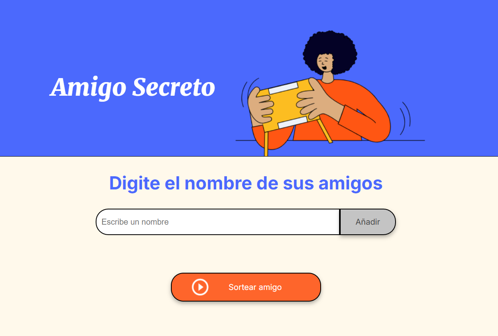

# Amigo Secreto 🎉

¡Bienvenido a la app de Amigo Secreto! Este es un proyecto donde puedes agregar amigos y hacer un sorteo aleatorio para decidir quién le toca regalar a quién. Todo esto con una interfaz simple y divertida. 💖



---

## Descripción

La aplicación permite ingresar los nombres de los amigos y luego sortear uno al azar. ¡Es la forma más divertida de jugar al "Amigo Secreto"!

### Funcionalidades 🚀:
- Agregar amigos a la lista.
- Ver la lista de amigos añadidos.
- Sortear un amigo aleatorio.
- Mostrar el nombre del amigo sorteado en la pantalla.

---

## Tecnologías utilizadas 🛠️

- **HTML**: Estructura básica de la página web.
- **CSS**: Estilos personalizados para la interfaz.
- **JavaScript**: Lógica para gestionar el sorteo y la lista.

---

## Instalación 🚀

1. Clona este repositorio en tu máquina local:

   ```bash
   git clone https://github.com/Ale1510-eng/ONE_challenge

## Estructura del Proyecto 📁

amigo-secreto/  

├── index.html        # Página principal  
├── style.css         # Estilos de la interfaz  
├── app.js            # Lógica del sorteo y la lista  
└── assets/           # Carpeta con las imágenes (opcional)  
    ├── amigo-secreto.png  
    └── play_circle_outline.png  
    
## Uso 📝
Agregar Amigos: Escribe el nombre de un amigo y haz clic en "Añadir".
Sortear un Amigo: Haz clic en "Sortear amigo" y se mostrará un amigo aleatorio.
